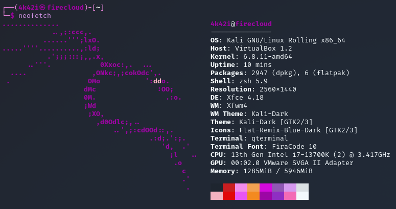
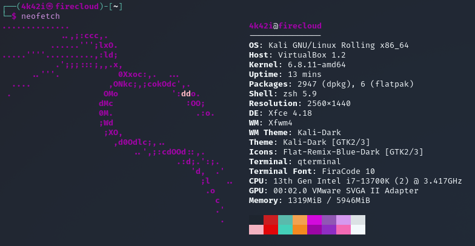

# qterminal-kali-purple-dark-colorscheme_unofficial
Customized Qterminal Colorscheme Files for Kali Purple Linux 

These are two color-schemes for the Linux terminal emulator qterminal. They are made to fit into the color-style of Kali Linux Purple.

File 1: kari-Kali-Purple-Dark.colorscheme
File 2: kari-Kali-Puprle-Dark_green.colorscheme

The kari-Kali-Purple-Dark.colorscheme will change colors more to Kali Purple's over all appearence, kari-Kali-Puprle-Dark_green.colorscheme will keep the green-bluish accents as shown in the screenshots below.

kari-Kali-Purple-Dark.colorscheme

kari-Kali-Puprle-Dark_green.colorscheme

Feel free to modify. I did this because Kali Linux doesnt have a Kali-Purple qterminal color scheme (yet) while I liked to use that. Thats why I made one and share it in case someone wants to use it too.
This colorscheme is not part of Kali Linux in any ways. It is just inspired by it's design.

Install:
Just download the two .colorscheme files and paste them into /usr/share/qtermwidget5/color-schemes/
After that you can start qterminal and select the colorscheme in "Preferences".
